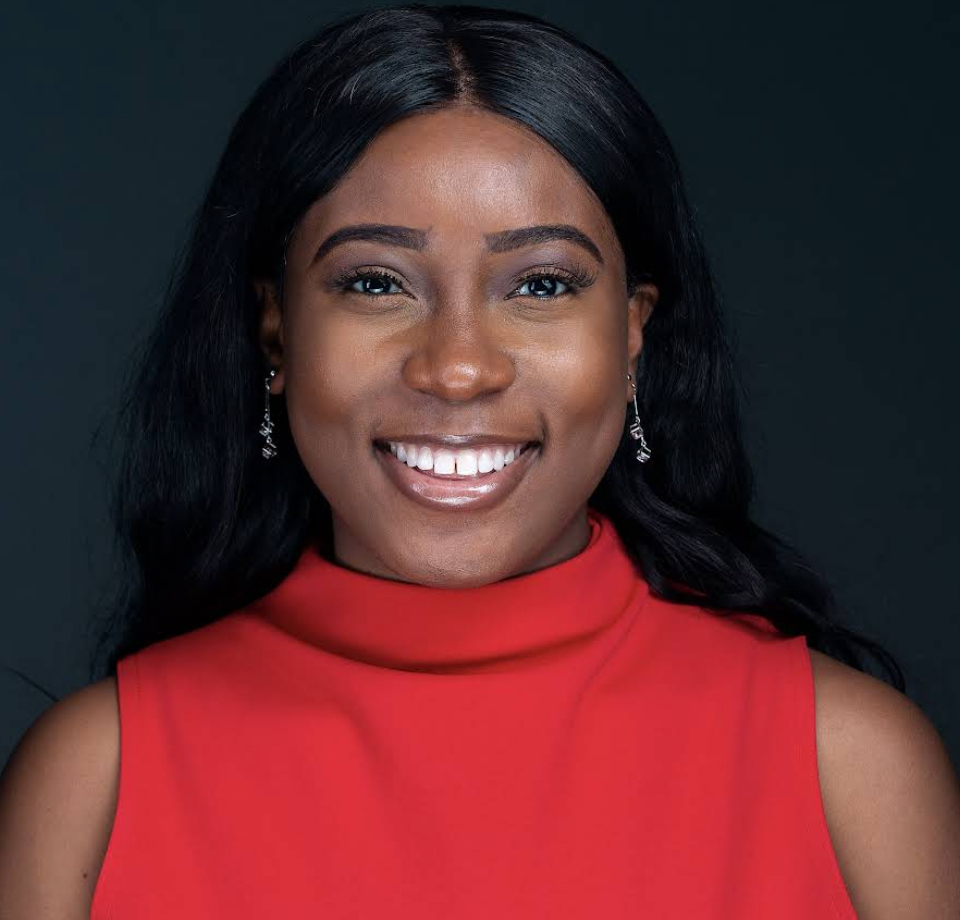

  

  <a href="https://github.com/Metu-O">Projects</a> •
  <a href="https://gitlab.com/Metu-O">GitLab</a> •
  <a href="https://www.linkedin.com/in/metuo/">LinkedIn</a>

---

## About Me

I am a Data Scientist working at the intersection of machine learning, bioinformatics, and healthcare, building models and pipelines for multimodal clinical data including medical imaging and next-generation sequencing (NGS).

My focus is on developing end-to-end ML systems that transform complex biological and clinical datasets into reliable, deployable tools that support precision medicine and improve patient outcomes.

### What I do

* Build machine learning pipelines for clinical and biological data
* Develop deep learning models for medical imaging and genomics
* Design end-to-end systems that move from experimentation to deployment
* Work with multimodal datasets in hospital and research environments

### Experience & Interests

* Hospital and biomedical research environments
* Genomic and microbial data analysis
* Deep learning for biomedical imaging
* Translating ML research into production-ready clinical workflows

### Goals

My goal is to build robust healthcare AI systems that integrate multimodal data to improve clinical decision-making in:

* Diagnosis support
* Risk stratification
* Treatment optimization
